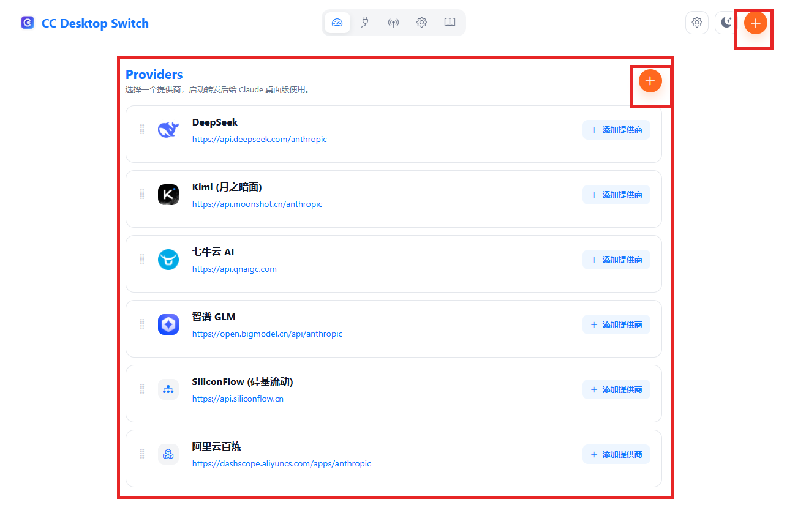
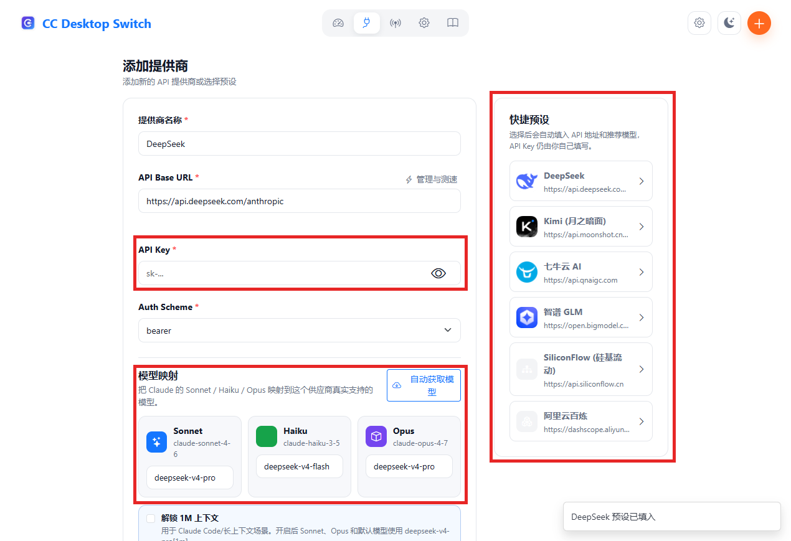
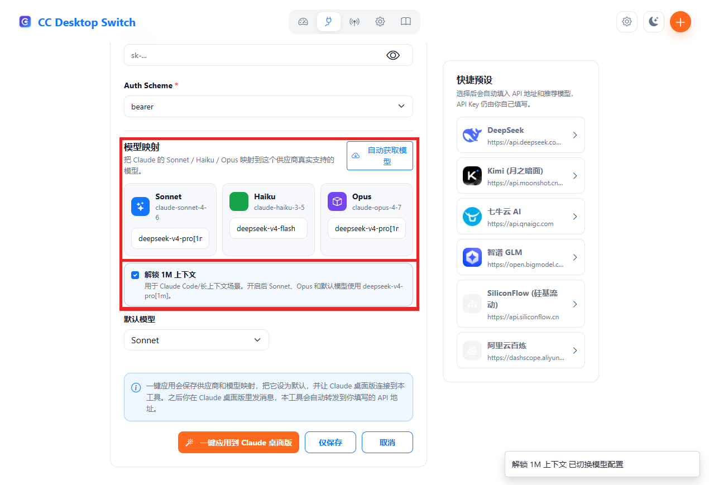
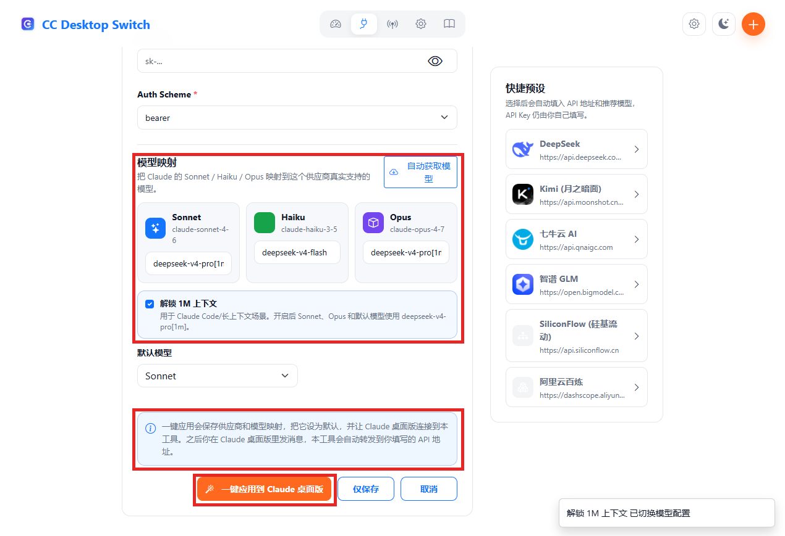

# CC Desktop Switch 图文快速教程

这份教程给第一次使用的人看。按下面 4 步走，不需要手动打开 Claude Desktop 的开发者模式。

## 1. 打开桌面应用

安装或解压后运行：

```text
CC-Desktop-Switch.exe
```

打开后先看首页。红框里的区域是主要操作区：选择提供商、查看状态、添加新提供商。



## 2. 添加 API 提供商

点击右上角 `+`，进入添加页面。先点右侧快捷预设，比如 DeepSeek、Kimi、七牛云、智谱、SiliconFlow 或阿里云百炼。

红框里的预设会自动填入 API 地址和推荐模型。API Key 需要你自己填写。



## 3. 确认模型映射

模型映射已经在添加页面下方。简单说，它负责把 Claude 的 Sonnet / Haiku / Opus 对应到厂商自己的模型名。

如果你选 DeepSeek，可以按需勾选“解锁 1M 上下文”。勾选后，Sonnet、Opus 和默认模型会使用 `deepseek-v4-pro[1m]`。

如果需要更深的推理，可以勾选“DeepSeek Max 思维”。Claude 界面可能仍显示 `High`，但本工具会按 DeepSeek Max 转发；不勾选则按默认配置运行。



## 4. 一键应用到 Claude 桌面版

填好 API Key 和模型映射后，点击红框里的“一键应用到 Claude 桌面版”。

这个按钮会保存配置、设为默认、写入 Claude 桌面版连接信息，并启动本机转发服务。

完成后重启 Claude Desktop，再正常发消息即可。



## 原理一句话

```text
Claude 桌面版 -> CC Desktop Switch -> 你的 API 提供商
```

Claude 桌面版只连接到本机的 CC Desktop Switch。真实的上游 API Key 保存在你自己的电脑里，不会直接写进 Claude 桌面版。

## 注意

- 不要把真实 API Key 放进截图、issue 或评论。
- Windows 版暂时没有 Authenticode 代码签名，系统可能提示未知发布者。
- 如果请求失败，先看“代理”页面的日志，再核对 API Key、余额和模型名。
